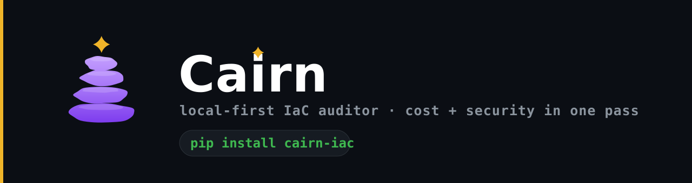

<p align="center">
  
</p>

<p align="center">
  <a href="https://pypi.org/project/cairn-iac/"></a>
  <a href="https://github.com/cairn-oss/cairn/actions/workflows/ci.yml"></a>
  <a href="LICENSE"></a>
  
</p>

<p align="center"><strong>Cairn</strong></p>
<p align="center"><em>The local-first, cloud-agnostic IaC auditor that fuses cost + security in a single pass — across AWS, Azure, GCP, Kubernetes and on-prem — and writes the fix, not just the flag.</em></p>
<p align="center">
  <a href="#installation">Install</a> ·
  <a href="#quick-start">Quick start</a> ·
  <a href="docs/rules.md">Rules</a> ·
  <a href="docs/architecture.md">Architecture</a> ·
  <a href="CONTRIBUTING.md">Contribute</a>
</p>

---

Cairn scans your Terraform on **your machine**, applies security, cost, reliability and governance rules in one pass, reconciles the trade-offs between them, and proposes concrete, ready-to-apply fixes.

```text
$ cairn scan examples/vulnerable

Cairn found 25 issue(s) in examples/vulnerable (6 cost, 6 governance, 3 reliability, 10 security):

1. [CRITICAL/SECURITY] aws_security_group.web  (SEC001)
   at:      examples/vulnerable/main.tf:4
   problem: Ingress on port 22 is open to the entire internet (0.0.0.0/0) and covers SSH/RDP.
   fix:     Restrict cidr_blocks to known ranges (office/VPN CIDRs), or front the service with a load balancer or SSM Session Manager instead of exposing it directly.
   patch:
     cidr_blocks = ["10.0.0.0/8"]  # replace with your trusted CIDR

   ...   (23 findings elided; each carries its own patch)

10. [MEDIUM/COST] aws_instance.batch  (COST001)
   at:      examples/vulnerable/main.tf:28
   problem: Instance type 'm5.4xlarge' is very large (~$561/month on-demand) and likely over-provisioned.
   fix:     Verify utilization (CloudWatch CPU/memory over 2+ weeks); a smaller type such as m5.xlarge often carries the load at a fraction of the cost. If sustained load is real, consider a savings plan instead of on-demand.
   saves:   ~$420.48/month (estimate)
   patch:
     instance_type = "m5.xlarge"

Trade-offs (cost x risk on the same resource):
  ⚖ aws_db_instance.main [COST + GOVERNANCE + RELIABILITY + SECURITY]
    Cost and security findings touch this resource. Sequence the security fix first, then right-size — resizing an exposed resource first just makes the breach cheaper to run.

Estimated recoverable spend: ~$1,717.53/month
9 resource(s), 1 file(s), 0.71s. Local-only scan; nothing left this machine.
```

## Why Cairn

Cost lives in one tool (Infracost, Kubecost), security in another (Checkov, Trivy), and nobody reconciles them at the moment of the decision. A change that saves money can widen your attack surface — and no scanner tells you that. Cairn is different by design:

- **Fuses cost + security.** One pass, one ranked report, explicit trade-offs when both hit the same resource, with estimated dollars next to every cost finding.
- **Fixes, not just flags.** Every finding carries plain-English remediation and, where safe, a ready-to-apply HCL patch.
- **Local-first, by architecture.** No SaaS, no upload, no telemetry. Your code, secrets and infrastructure data never leave your machine. LLM explanations are strictly opt-in and bring-your-own-key (or fully local via Ollama).
- **Policy-as-code around the scanner.** Encode your org's standards — required tags, severity gates, grandfathered ignores — in a reviewable `.cairn.yaml`.
- **Built to operate, eventually.** Every action is governed by the [Trust Ladder](docs/architecture.md#the-trust-ladder): today read-only with an audit trail; auto-fix PRs and policy-gated remediation come only after trust is earned.

## Installation

Requires Python 3.10+.

```bash
pip install cairn-iac
```

Or run from source:

```bash
git clone https://github.com/cairn-oss/cairn && cd cairn
pip install -e .
```

Or via Docker:

```bash
docker build -t cairn . && docker run --rm -v "$PWD:/scan" cairn scan /scan
```

## Quick start

```bash
# Scan a directory (recursive; .terraform/ and vendored dirs are skipped)
cairn scan ./infra

# Machine formats for CI and code scanning
cairn scan ./infra --format json   --output report.json
cairn scan ./infra --format sarif  --output report.sarif   # GitHub Code Scanning
cairn scan ./infra --format markdown --output report.md    # paste into a PR

# Gate CI: exit 1 only on HIGH or CRITICAL (default), or choose your line
cairn scan ./infra --fail-on CRITICAL
cairn scan ./infra --fail-on NEVER        # report, never fail

# Draft the fixes as a review-ready proposal (changes nothing)
cairn propose ./infra --output proposal.md

# What does this branch do to the bill? (exit 1 if it breaches your budget)
cairn diff ./infra-main ./infra-branch

# See every rule
cairn rules
```

### Policy-as-code

Drop a `.cairn.yaml` next to your Terraform:

```yaml
min_severity: LOW
fail_on: HIGH
required_tags: [Owner, CostCenter]
disabled_rules: [GOV001]
severity_overrides:
  COST002: MEDIUM
ignores:
  - rule: SEC001
    resource: aws_security_group.legacy_*
    reason: grandfathered until the Q3 migration
```

Need a documented exception? Suppress one rule for one resource, inline,
with a mandatory reason:

```hcl
# cairn:ignore SEC001 reason=reachable only through the corporate VPN
```

See [docs/configuration.md](docs/configuration.md) for the full reference.

### Opt-in AI explanations (BYO-key or fully local)

Cairn never sends anything anywhere by default. If you want tailored explanations, configure a provider and pass `--explain`:

```yaml
llm:
  provider: ollama      # fully local — data still never leaves your machine
  model: llama3.1
```

```bash
cairn scan ./infra --explain
```

`openai` and `anthropic` providers use your own API key from the environment (`OPENAI_API_KEY` / `ANTHROPIC_API_KEY`). Only the finding itself (rule, resource address, message) is sent — never your files. Details in [SECURITY.md](SECURITY.md).

### GitHub Actions

```yaml
- uses: cairn-oss/cairn@v0
  with:
    path: ./infra
    fail-on: HIGH
```

Or upload SARIF to Code Scanning — see [docs/configuration.md#ci](docs/configuration.md#ci).

## What it checks (42 rules across 5 providers)

| Discipline | Examples |
|---|---|
| **Security** | Open security groups (SSH/RDP → CRITICAL), unencrypted S3/RDS/EBS, public databases and buckets, `*:*` IAM policies, hardcoded secrets, IMDSv1, plaintext listeners |
| **Cost** | Oversized EC2/RDS (with $/month estimates), gp2→gp3, orphaned volumes and Elastic IPs, previous-generation instance types, K8s containers without limits |
| **Reliability** | Databases without backups or deletion protection, buckets without versioning, unpinned images, missing health probes |
| **Governance** | Untagged resources, org-mandated tags via policy |
| **Kubernetes** | Privileged containers, root containers, hostPath mounts — manifests and Terraform scan together, in one pass |
| **Azure / GCP / vSphere** | Network exposure, public storage/DB, encryption, oversizing, tagging — cloud-agnostic and on-prem, filterable with `--provider` |

Full catalogue with rationale and references: [docs/rules.md](docs/rules.md).

Run `cairn providers` for live coverage. Terraform for any provider is
parsed; resources from providers without a rule pack are reported as **not
scanned** (never a misleading "clean"). Coverage detail: [docs/coverage.md](docs/coverage.md).

## Exit codes

| Code | Meaning |
|---|---|
| 0 | Scan completed; nothing at/above the fail threshold |
| 1 | Findings at/above the fail threshold remain |
| 2 | Cairn could not run (bad path, broken config, usage error) |

## Project status & roadmap

Cairn is at **v0.6** — Terraform + Kubernetes scanning, `propose`
(Trust Ladder rung 1), policy packs, pre-merge cost diffing, and the
open-core boundary drawn in code. Shipped and designed releases are in
[ROADMAP.md](ROADMAP.md). Architecture and decision records live
in [docs/](docs/).

## Contributing & governance

Rules are single, small Python functions — adding one is a great first PR. Start with [CONTRIBUTING.md](CONTRIBUTING.md); propose a rule with the [rule proposal template](.github/ISSUE_TEMPLATE/rule_proposal.yml).

Everyone is welcome to contribute; **maintainers make the final merge after reviewing each pull request**, and only maintainers cut releases. The model — roles, the merge gate, and how production is protected — is in [GOVERNANCE.md](GOVERNANCE.md) and [docs/merge-and-security-policy.md](docs/merge-and-security-policy.md).

## Free vs. paid

Everything in this repository is free forever — enumerated in code and
tested (`cairn license` prints the list). Team/Enterprise capabilities
(org rollups, SSO, compliance evidence) live in a separate commercial
package and never restrict the core.

## License

[MIT](LICENSE). The core is free forever — see the project principles in [docs/architecture.md](docs/architecture.md).
