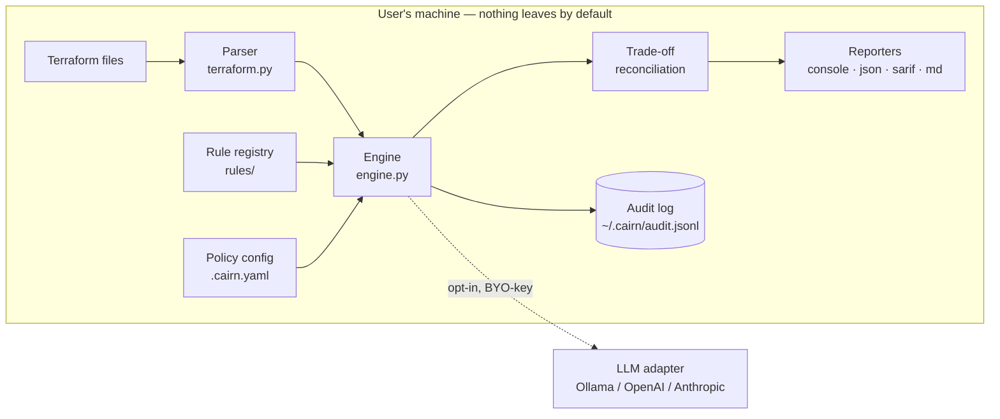

# Architecture

Cairn is a **local-first, modular pipeline**: parse → detect → policy →
reconcile → report, with an audit trail underneath and an opt-in LLM adapter
on the side. Everything runs on the user's machine; nothing that matters
leaves it.

## The pipeline

1. **Parse** (`terraform.py`). Recursive `.tf` discovery (vendored dirs
   skipped), HCL2 parsing with normalization (unquoting, heredoc bodies,
   block markers), line-number recovery, and per-file error isolation: one
   malformed file never aborts a repository scan.
2. **Detect** (`rules/`). Each rule is a registered function receiving one
   resource plus a `ScanContext` (all resources + policy inputs) for
   cross-resource reasoning — e.g. an S3 bucket is only flagged for missing
   encryption if no companion `aws_s3_bucket_server_side_encryption_configuration`
   references it.
3. **Policy** (`policy.py`). Deterministic guardrails around the detectors:
   disabled rules, glob ignores with reasons, severity overrides, a severity
   floor, and the CI fail threshold. A malformed policy fails loudly (exit
   2) — a broken guardrail must never silently pass.
4. **Reconcile** (`engine.py`). The differentiator: when cost and
   security/reliability findings collide on one resource, Cairn emits a
   single sequenced trade-off instead of siloed alerts.
5. **Report** (`report/`). Four renderers over one `ScanResult`: human
   console, versioned JSON, SARIF 2.1.0 for code scanning, and Markdown for
   PRs. All reporters share a uniform signature so new formats are trivial.

## The unified findings model

Every rule in every discipline emits the same `Finding` schema
(`findings.py`): rule ID, severity, category, resource address,
file/line, message, fix text, optional fix snippet, optional `monthly_cost`
estimate, references. One schema is what makes ranking, policy filtering
and cross-discipline reconciliation possible — it is the contract the whole
system is built around, and it is versioned in the JSON reporter.

## The Trust Ladder

Cairn's action-governance spine. Autonomy is granted per category, one
rung at a time, always audited:

| Rung | Posture | Status |
|---|---|---|
| 0 | **Read-only** — scan, report, audit | ✅ v0.1 |
| 1 | **Propose** — draft the change; a human reviews and applies | ✅ v0.2 (`cairn propose`) |
| 2 | **Auto-remediate low-risk under policy** — explicit per-category grants | ✅ v0.5 (`cairn fix --apply`) |

v0.1 deliberately ships rung 0 *with* the audit trail (`audit.py`): the
evidence habit must exist before any autonomy is introduced. The audit log
is append-only JSONL, local, and contains scan metadata only.

## The LLM adapter (and its privacy contract)

`llm.py` is a replaceable adapter, not a dependency: the default provider is
`none`, and the scan pipeline is fully functional — findings, fixes, dollar
estimates — without any model. When explicitly enabled (`--explain` +
configuration), it sends *only the finding itself* to the user's own
provider (their key, or local Ollama). Any failure degrades gracefully to
the rule-based fix text. This ordering — deterministic rules first,
probabilistic explanation second — is deliberate: the LLM enriches; it never
gates.

## Extension points

- **New rule**: one function + decorator (see CONTRIBUTING.md). No other
  file needs touching; the registry, reporters, policy and SARIF metadata
  pick it up automatically.
- **New reporter**: implement `render(result, explanations, color) -> str`,
  register in `report/__init__.py`.
- **New LLM provider**: add a branch in `llm.build_explainer` (or an
  OpenAI-compatible `base_url` — Ollama, vLLM, LM Studio already work).
- **New IaC target** (Kubernetes, Pulumi): a parallel parser producing
  `Resource` objects; rules and everything downstream are agnostic.

## Performance characteristics

The scan is CPU-light and I/O-bound: ~0.1 s for a typical module, linear in
file count; rules are O(resources × applicable rules) with type-based
short-circuiting. There are no network calls in the hot path and no caching
layer to invalidate. The heaviest cost is HCL parsing (lark grammar), which
is per-file isolated and could be parallelized later without design change.
